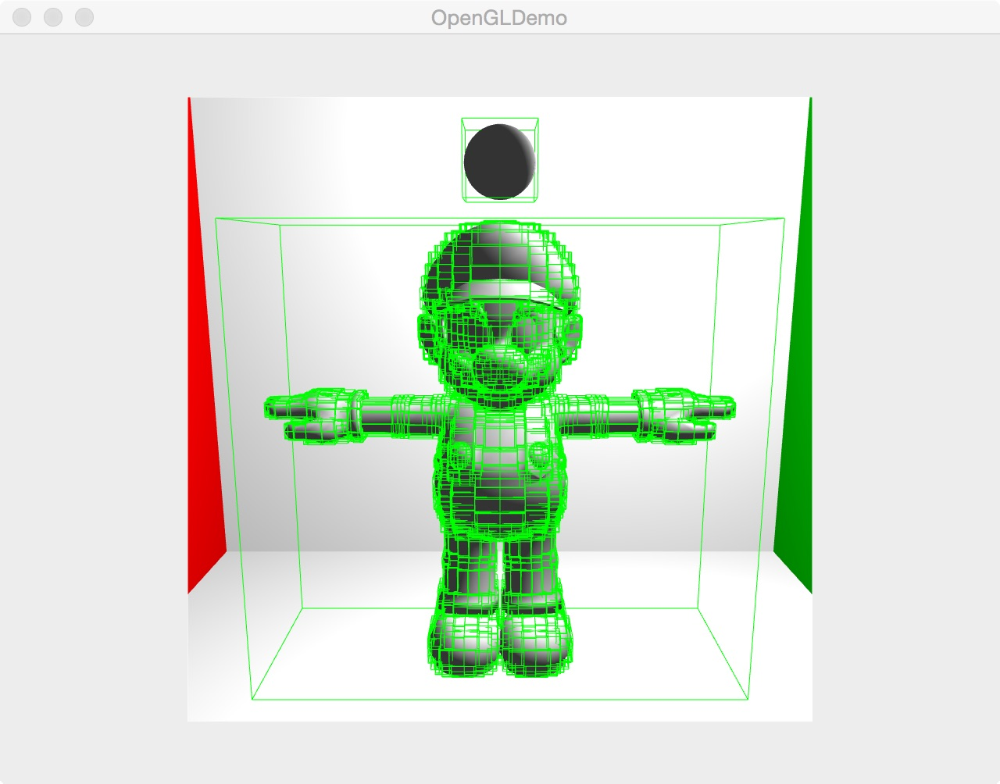
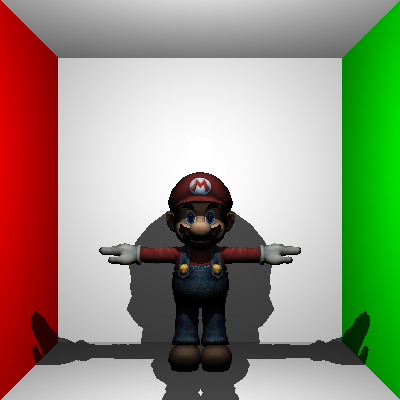
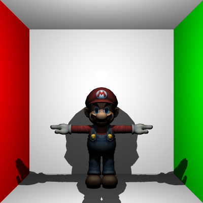
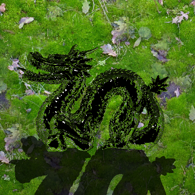
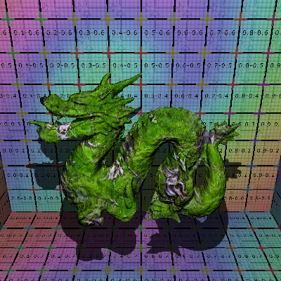

# Graphics_BVH
CIS 560 project - BVH acceleration structure & Anti-Aliasing

Apply Bounding Volume Hierarchy to accelerate render.

**Sample BVH for Wahoo**
</img>

**Sample renders**
------------------------------
Anti-aliasing, 1 sample per pixel VS 4 sample per pixel 
</img>
</img>

 

Dragon with reflective brdf material: 400px*400px, render time: 3291ms 
</img> 
    
 

Dragon with normal map and texture: 400px*400px, render time: 2880ms  
</img> 
    

